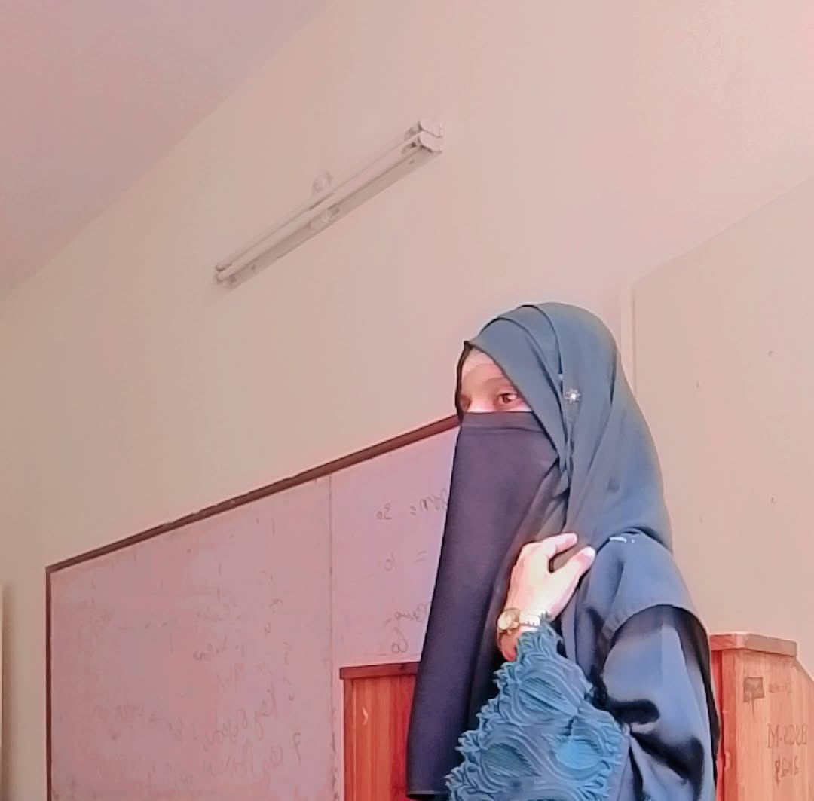

<!-- Header Banner -->

 
 

<!-- Animated Typing Text -->

 

<!-- Profile Badges -->

  
  
  

---

### 👩‍💻 About Me

* **Focus Areas:** Artificial Intelligence, Generative AI, Agentic AI & RAG Applications
* **Current Project:** Lead Developer for **CivicFlow AI**
* **Exploring:** LLM Integration, Web Development & Mobile Applications

---

### 🏛️ Featured Project

#### 🚀 CivicFlow AI — Citizen Issue Reporting & Management System
An AI-powered smart platform designed to help citizens report issues and track progress efficiently.

* **Smart Triage:** AI-driven issue categorization and priority assignment.
* **Location Tracking:** Geolocation-tagged reporting for high accuracy.
* **Management Hub:** Interactive admin dashboard with automated status updates.

---

### 🛠️ Tech Stack & Tools

**Languages & Databases**  

**Development Tools**  

---

### 📂 Other Projects

* **CRUD Management System:** Student Database Management System built using `PHP`, `MySQL`, `HTML`, and `CSS`.

---

### 📊 GitHub Statistics

  
  

  

---

✨ **Learning • Building • Growing** ✨

